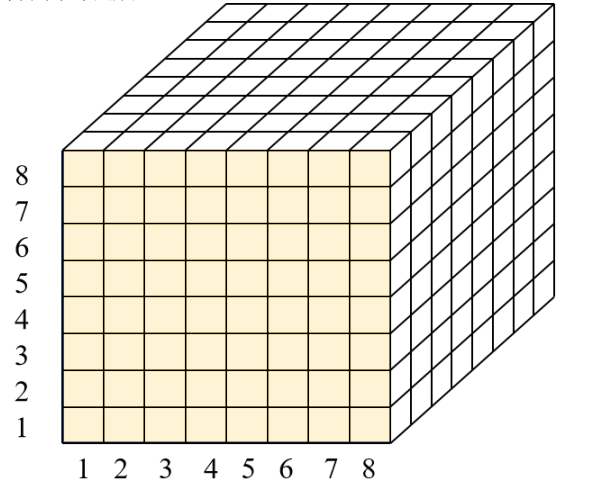

# 信息隐藏技术实验五
> 李潇逸    2111454


## 实验内容
1. 实现对1-8任意位平面的提取并显示；
2. 实现对1~n低位平面的图像显示和8~（n+1）高位平面的图像显示；
3. 实现去掉1~n位平面后的图像的显示。


## 实验原理
图像中的各个像素由八个比特组成，值为 0 255，各个像素相同的位形成一个平面，称为“位平面”，如下图所示。



## 实验过程

### 1-8任意位平面
将图片读入，并将其每个像素点的二进制表示的第 1 到第 n 位提取出来，然后将这些位重新组合成一张新的图片并显示出来。其中，k 是自己输入的参数，表示要提取的二进制位数；a 和 b 分别表示图片的高度和宽度；y 和 z 是用来存储提取出来的二进制位的数组；x 是临时变量，用来存储每个像素点的二进制表示的第 1 到第 n 位；bitget 函数用来提取二进制位；bitset 函数用来重新组合二进制位；imshow 函数用来显示图片；title 函数用来设置图片的标题，其中 num2str 函数用来将数字转换成字符串。最终，这段代码会显示出一张新的图片，其中每个像素点的二进制表示的第 1 到第 n 位与原图片不同。即，接收了自己的输入以后，作为要显示的位平面，之后，通过 bitget 函数提取相应的位平面。
```matlab
% Clear Memory and Command window
clc;
clear all;
close all;
img = imread("C:\Users\19309\Desktop\document\信息隐藏技术\第五次实验\picture\Xiangling_gray.png");

k = input("请输入要显示的位平面：");

[m,n]=size(img);
c=zeros(m,n);
for i=1:m
    for j=1:n
        c(i,j)=bitget(img(i,j),k);
    end
end
figure;
imshow(c,[]);
title(['这是第',num2str(k),'个位平面']);
```
#### 实验结果


### 1-n 低位平面的图像显示和 (n+1)-8 高位平面的图像显示
首先将图片读入，并将其每个像素点的二进制表示的第 1 到第 k 位提取出来，然后将这些位重新组合成一张新的图片并显示出来。同时，还将原图片的第 k+1 到第 8 位提取出来，重新组合成另一张新的图片并显示出来。其中，k 是用户输入的参数，表示要提取的二进制位数；a 和 b 分别表示图片的高度和宽度；y 和 z 是用来存储提取出来的二进制位的数组；x 是临时变量，用来存储每个像素点的二进制表示的第 1 到第 k 位或第 k+1 到第 8 位；bitget 函数用来提取二进制位；bitset 函数用来重新组合二进制位；imshow 函数用来显示图片；title 函数用来设置图片的标题，其中 num2str 函数用来将数字转换成字符串。最终，这段代码会显示出两张新的图片，其中一张图片的每个像素点的二进制表示的第 1 到第 k 位与原图片相同，而另一张图片的每个像素点的二进制表示的第 k+1 到第 8 位与原图片不同。
```matlab
% Clear Memory and Command window
clc;
clear all;
close all;
img = imread("C:\Users\19309\Desktop\document\信息隐藏技术\第五次实验\picture\Xiangling_gray.png");
k = input("请输入n的值：");

[a,b]=size(img);

y=zeros(a,b);
z=zeros(a,b);

for n=1:k
    for i=1:a
        for j=1:b
            x(i,j)=bitget(img(i,j),n); 
        end
    end
    for i=1:a
        for j=1:b
            y(i,j)=bitset(y(i,j),n,x(i,j));
        end
    end 
end


for n=k+1:8
    for i=1:a
        for j=1:b
            x(i,j)=bitget(img(i,j),n); 
        end
    end
    for i=1:a
        for j=1:b
            z(i,j)=bitset(z(i,j),n,x(i,j));
        end
    end 
end


figure;
imshow(y,[]);
title(['第1-',num2str(k),'个位平面']);


figure;
imshow(z,[]);
title(['第',num2str(k+1),'-8个位平面']);
```
#### 实验结果


### 去掉 1-n 位平面后的图像的显示
将图片读入，并将其每个像素点的二进制表示的前 k 位清零，然后显示出来。其中，k 是用户输入的参数，表示要清零的二进制位数；a 和 b 分别表示图片的高度和宽度；img是用来存储图片的数组；bitset 函数用来将指定二进制位清零；imshow 函数用来显示图片；title函数用来设置图片的标题，其中 num2str 函数用来将数字转换成字符串。最终，这段代码会显示出一张新的图片，其中每个像素点的二进制表示的前 k 位被清零，而后面的位数保持不变。这个操作可以用于图像处理中的信息隐藏，即将一些敏感信息嵌入到图片的低位二进制位中，然后将高位二进制位清零，从而达到隐藏信息的目的。
```matlab
% Clear Memory and Command window
clc;
clear all;
close all;
img = imread("C:\Users\19309\Desktop\document\信息隐藏技术\第五次实验\picture\Xiangling_gray.png");
%k = input("请输入n的值：");
for k=1:7
    [a,b]=size(img);
    
    for n=1:k
        for i=1:a
            for j=1:b
                img(i,j)=bitset(img(i,j),n,0);
            end
        end 
    end
    
    figure;
    imshow(img,[]);
    title(['去除前',num2str(k),'个位平面']);
end
```
#### 实验结果


